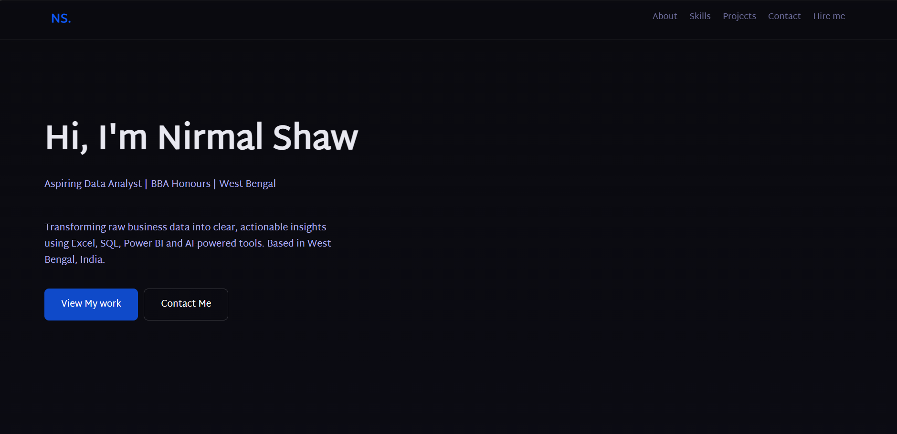

# Personal Portfolio Website

## Overview
A fully responsive personal portfolio website built from scratch using HTML, CSS and JavaScript. Designed to showcase my data analytics projects, technical skills and certifications.

## Features
- Responsive design using CSS media queries
- Smooth scroll animations using Intersection Observer API
- Glassmorphism navbar with backdrop blur effect
- Certificate image viewer
- Contact form powered by Formspree
- SEO optimized with semantic HTML and meta tags

## Sections
- Hero
- About
- Skills
- Certifications
- Projects
- Contact

## Technologies Used
- HTML5
- CSS3
- JavaScript
- Git & GitHub Pages

## Live Demo
[View Live Site](https://nirmal-shaw.github.io)

## Author
**Nirmal Shaw**
- LinkedIn: [linkedin.com/in/nirmal-shaw](https://linkedin.com/in/nirmal-shaw)
- GitHub: [github.com/nirmal-shaw](https://github.com/nirmal-shaw)
